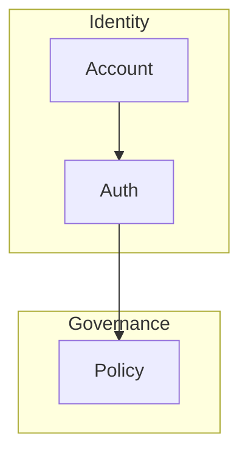
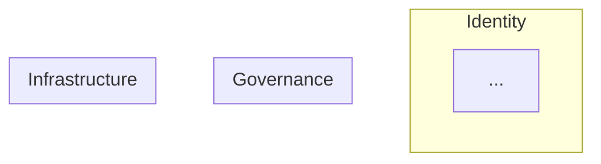

# Xuanwu Diagram Design Standards

This skill is the single source of truth for visual standards applied to all Mermaid
architecture diagrams in the Xuanwu repository.

---

## Architecture Layer Color System

All diagrams MUST use consistent layer-based semantic grouping. The following table
defines the canonical architecture layer names and their semantic meanings. Use Mermaid
`subgraph` blocks labelled with these layer names to reflect which layer each component
belongs to:

| Layer | Semantic Meaning |
|-------|-----------------|
| Identity | identity / actor / account |
| Governance | tenant / policy / rules |
| Semantic | ontology / tagging / classification |
| Task / Skill | task system / skill system |
| Data Lifecycle | ingestion / parsing / storage |
| Matching / AI | AI matching / reasoning |
| Infrastructure | database / cloud / storage |
| Observability | monitoring / logging |

---

## Diagram Standards

Use **Mermaid only**. No other diagram format is accepted.

Preferred diagram types (in order of preference):

- `flowchart TD` / `graph TD` — top-down architecture flows
- `graph LR` — left-right dependency chains
- `sequenceDiagram` — protocol / interaction sequences

Avoid unnecessary diagram types (e.g. `pie`, `gantt`, `er`) unless explicitly required.

---

## Layout Principles

Architecture MUST visually flow in canonical layer order:

```
Identity
↓
Governance
↓
Semantic
↓
Task / Skill
↓
Data Lifecycle
↓
Matching / AI
↓
Infrastructure
↓
Observability
```

Group components that belong to the same layer inside a Mermaid `subgraph`:



---

## Minimal Edges

Avoid:

- Crossing lines
- Chaotic node connections
- Redundant arrows

Prefer clear directional flow with as few edge crossings as possible.

---

## Semantic Grouping

Related components that belong to the same layer MUST be grouped using Mermaid `subgraph` blocks:



---

## Diagram Refactoring Rules

You MAY:

- Reorganize node layout
- Group components into subgraphs
- Simplify flows
- Remove redundant nodes
- Rename nodes for clarity

You MUST NOT:

- Invent new architecture components
- Change system meaning
- Introduce new subsystems not present in the surrounding documentation

---

## Editing Strategy

When refining a diagram:

1. Read surrounding documentation to understand the architecture meaning.
2. Identify unclear flows, missing groupings, or nodes that misrepresent the system.
3. Reorganize node layout following layer order from top to bottom.
4. Apply `subgraph` blocks that align with the architecture layer color system.
5. Simplify the graph — remove clutter without losing semantic meaning.
6. Verify the final diagram matches the surrounding narrative and SSOT documents.

Always ensure the diagram matches the architecture narrative before committing.

---

## Quality Target

A good diagram should:

- Be readable in under 5 seconds
- Clearly show system layers
- Avoid visual clutter
- Resemble professional architecture documentation

Think like a principal architect presenting a system design.
