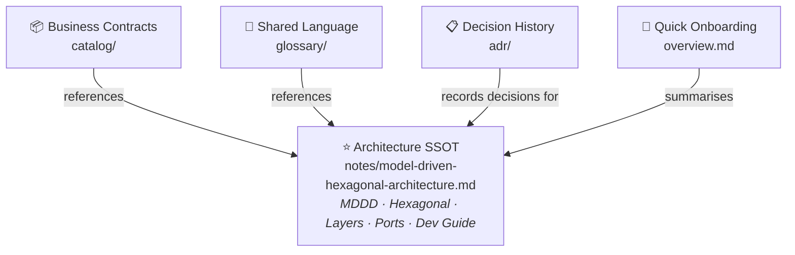
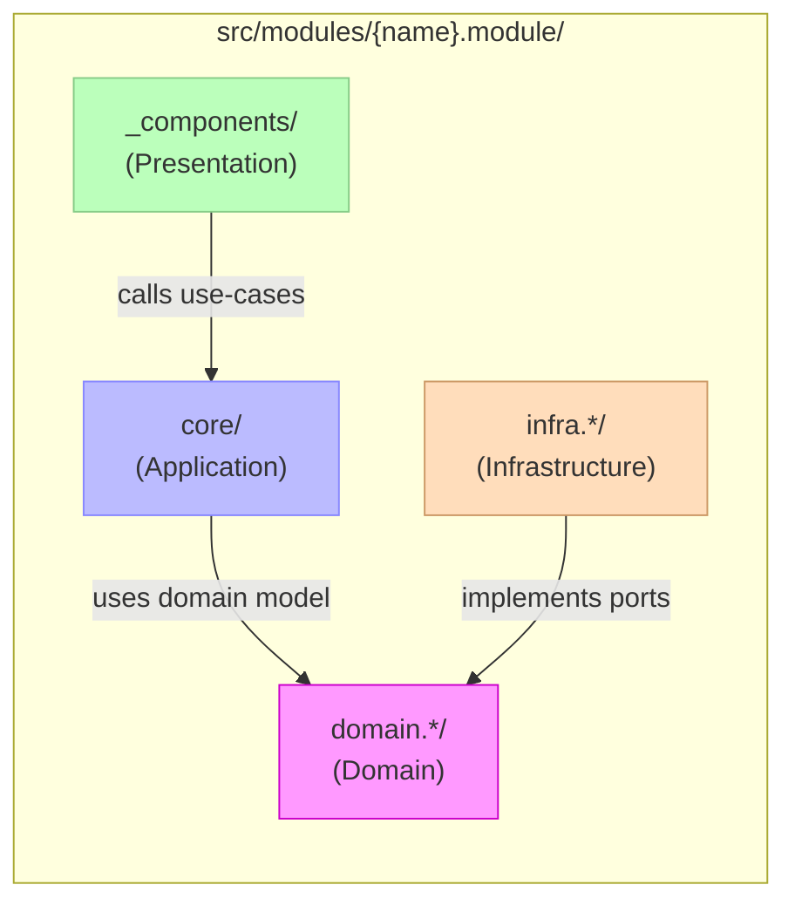

# Architecture Navigation Hub / 架構導覽中心

> Tags: `architecture` `navigation` `index` `ssot-gateway`（定義見 [Tag Taxonomy](../management/documentation-index.md#tag-taxonomy)）

This file is a **navigation gateway**, not a concept-definition document.
All canonical architecture concepts are centralized in:

- **[Model-Driven Hexagonal Architecture](./notes/model-driven-hexagonal-architecture.md)** ← Architecture SSOT

---

## SSOT Hierarchy / SSOT 層級

---

## Module Layer Structure / 模組層次結構

---

## Navigation Table / 導覽表

| Level | Document | Role | Tags |
|---|---|---|---|
| L0 (Core) | [notes/model-driven-hexagonal-architecture.md](./notes/model-driven-hexagonal-architecture.md) | **Architecture SSOT**: MDDD, Ports & Adapters, layer rules, context mapping, development guide | `ssot` `architecture-core` |
| L1 (Contracts) | [catalog/index.md](./catalog/index.md) | Business contracts index (entities/events/boundary) | `catalog` `contracts` |
| L1 (Terminology) | [glossary/glossary.md](./glossary/glossary.md) | Shared language and terms | `glossary` |
| L1 (Decisions) | [adr/README.md](./adr/README.md) | Architecture Decision Records and rationale | `adr` `decision-log` |
| L2 (Onboarding) | [overview.md](./overview.md) | Quick architecture snapshot for new contributors | `quickstart` `onboarding` |
| Cross-doc governance | [../management/documentation-index.md](../management/documentation-index.md) | Duplication rules, ownership map, documentation governance | `governance` |

---

## Anti-duplication Rule / 防重複規則

For architecture docs, keep this split:

- **Define concepts once** in `notes/model-driven-hexagonal-architecture.md`.
- **Reference concepts** everywhere else with links.
- **Store concrete contracts** in `catalog/`.
- **Store terminology** in `glossary/`.
- **Store why-decisions** in `adr/`.

When duplication is found, keep the most authoritative version in the designated SSOT location and replace duplicated paragraphs with a short link.

If a document repeats long conceptual explanation, replace it with a short pointer to the SSOT.
