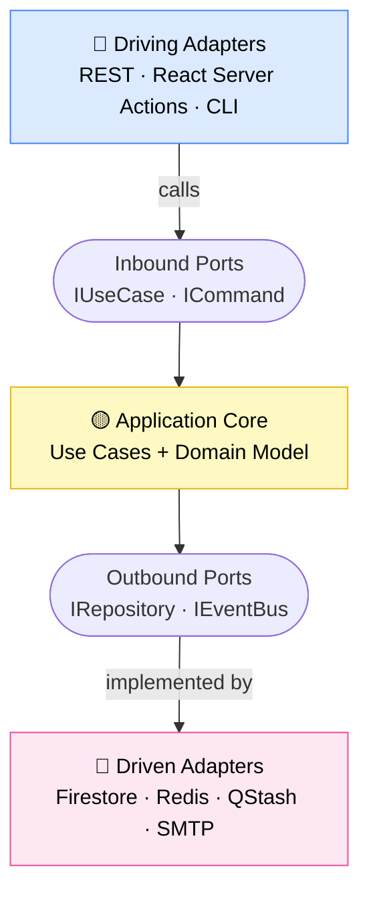
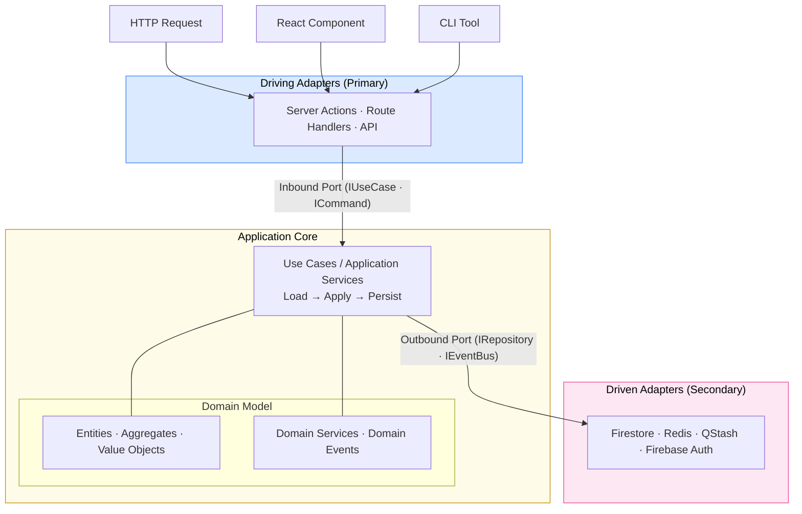
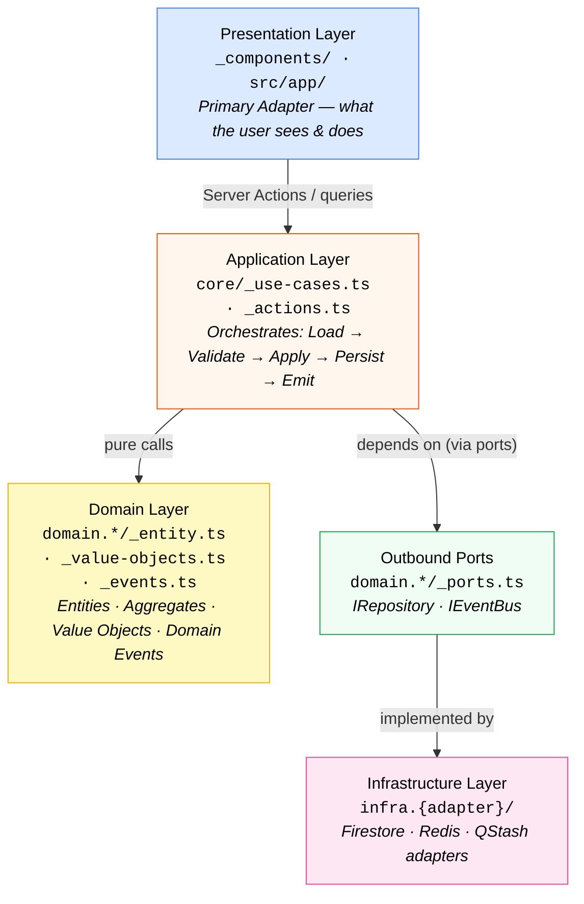

# Model-Driven Hexagonal Architecture

> Tags: `ssot` `architecture-core` `ddd` `hexagonal` `layer-rules` `context-map` `development-guide` `quick-reference`
> Design philosophy and development guide for the **xuanwu-platform**.
> Primary reference for how DDD and Hexagonal Architecture (Ports & Adapters) are unified in this project.

---

## Table of Contents

1. [Philosophy Overview](#1-philosophy-overview)
2. [Core Concepts — MDDD Vocabulary](#2-core-concepts--mddd-vocabulary)
   - 2.1 [Bounded Context](#21-bounded-context-限界上下文)
   - 2.2 [Ubiquitous Language](#22-ubiquitous-language-通用語言)
   - 2.3 [Context Mapping](#23-context-mapping-上下文映射)
   - 2.4 [Aggregate & Aggregate Root](#24-aggregate--aggregate-root-聚合與聚合根)
   - 2.5 [Invariants](#25-invariants-不變性約束)
   - 2.6 [Separation of Concerns](#26-separation-of-concerns-關注點分離)
3. [Hexagonal Architecture — Ports & Adapters](#3-hexagonal-architecture--ports--adapters)
   - 3.1 [The Hexagon Mental Model](#31-the-hexagon-mental-model)
   - 3.2 [Inbound Ports (Driving Side)](#32-inbound-ports-driving-side)
   - 3.3 [Outbound Ports (Driven Side)](#33-outbound-ports-driven-side)
   - 3.4 [Adapters](#34-adapters)
4. [How DDD Maps onto Hexagonal Architecture](#4-how-ddd-maps-onto-hexagonal-architecture)
5. [Xuanwu 4-Layer Implementation](#5-xuanwu-4-layer-implementation)
   - 5.1 [Layer Structure](#51-layer-structure)
   - 5.2 [Dependency Rules](#52-dependency-rules)
   - 5.3 [File Placement Convention](#53-file-placement-convention)
6. [Context Mapping in Xuanwu](#6-context-mapping-in-xuanwu)
   - 6.1 [SaaS ↔ Workspace Boundary](#61-saas--workspace-boundary)
   - 6.2 [Context Map Patterns Used](#62-context-map-patterns-used)
7. [Port & Adapter Catalogue](#7-port--adapter-catalogue)
   - 7.1 [Shared (Cross-Cutting) Ports](#71-shared-cross-cutting-ports)
   - 7.2 [Module-Owned Ports](#72-module-owned-ports)
8. [Development Guide — Working with this Architecture](#8-development-guide--working-with-this-architecture)
   - 8.1 [Adding a New Feature](#81-adding-a-new-feature)
   - 8.2 [Adding a New Port](#82-adding-a-new-port)
   - 8.3 [Crossing a Bounded Context Boundary](#83-crossing-a-bounded-context-boundary)
   - 8.4 [Common Anti-Patterns to Avoid](#84-common-anti-patterns-to-avoid)
   - 8.5 [Consistency Boundary & Transaction Semantics](#85-consistency-boundary--transaction-semantics)
   - 8.6 [Event Contract Versioning (Simple Rules)](#86-event-contract-versioning-simple-rules)
   - 8.7 [Authorization Boundary](#87-authorization-boundary)
   - 8.8 [Composition Root & Dependency Wiring](#88-composition-root--dependency-wiring)
   - 8.9 [Read/Write Separation (CQRS)](#89-readwrite-separation-cqrs)
   - 8.10 [Observability Baseline](#810-observability-baseline)
9. [Quick Reference](#9-quick-reference)

---

## 1. Philosophy Overview

Xuanwu uses **Model-Driven Domain Discovery (MDDD)** as its design process and **Hexagonal Architecture (Ports & Adapters)** as its structural blueprint. The domain model — not the database, not the UI — is the centre of gravity. Business rules live in **Entities** and **Aggregates**; infrastructure details (Firebase, Redis, QStash) are plug-in concerns. The public API of every module reflects the **Ubiquitous Language** of its Bounded Context.



The application core **never imports from adapters**. It defines **interfaces** (ports) that adapters implement — the Dependency Inversion Principle applied at the architecture level.

---

## 2. Core Concepts — MDDD Vocabulary

> Full term definitions → [`docs/architecture/glossary/`](../glossary/)

### 2.1 Bounded Context (限界上下文)

**Definition**: A linguistic and logical boundary within which every term has exactly one meaning.
**In Xuanwu**: Each `src/modules/{name}.module/` is a Bounded Context; `index.ts` is its only public surface.
**Rules**: Never import internal files across modules. Share data via typed DTOs or Domain Events only.
**Diagnostic**: *"Does this word mean the same thing here as in another module?"* If not, you've found a boundary.

> Example: `"Account"` in `account.module` = platform user account; in `settlement.module` = financial ledger account.

---

### 2.2 Ubiquitous Language (通用語言)

**Definition**: Shared vocabulary used by domain experts and developers alike — in code identifiers, DB fields, event names, and docs.
**In Xuanwu**: Canonical vocabulary → [`docs/architecture/glossary/`](../glossary/). Domain events target `{domain}.{entity}.{verb}` (e.g. `wbs.task.state_changed`).

> ⚠️ Runtime event type strings in `_events.ts` files currently use colon-separated format (e.g. `workspace:task:state:changed`) — a known deviation pending migration.

**Diagnostic**: *"Does a business sentence map 1:1 to code entities without translation?"*

---

### 2.3 Context Mapping (上下文映射)

**Definition**: The high-level relationship map describing direction of influence and integration patterns between Bounded Contexts.
**In Xuanwu**: See [Section 6](#6-context-mapping-in-xuanwu) for the full Context Map.

| Pattern | Description |
|---------|-------------|
| **Upstream / Downstream** | Upstream shapes the model; downstream adapts |
| **Anticorruption Layer (ACL)** | Downstream translates upstream data to protect its own model |
| **Open Host Service** | Upstream publishes a formal, versioned API for multiple consumers |
| **Published Language** | Well-documented exchange format (e.g. domain events) |
| **Partnership** | Two contexts co-evolve under mutual agreement |
| **Conformist** | Downstream copies upstream model without translation |
| **Shared Kernel** | Small, jointly-maintained sub-model |
| **Customer / Supplier** | Downstream negotiates interface requirements with upstream |

---

### 2.4 Aggregate & Aggregate Root (聚合與聚合根)

**Definition**: An **Aggregate** is a cluster of domain objects treated as a single unit for data changes. The **Aggregate Root** is the sole entry point; all business invariants are enforced there.
**Rules**: (1) Only the root has a globally stable persisted ID. (2) External objects hold only the root's ID. (3) Repositories load/save only roots. (4) Cross-aggregate communication via Domain Events only.

```
Aggregate: Workspace
├── Root: Workspace (workspaceId)
├── Entity: WorkspaceMember (memberId)     ← via Workspace only
└── Entity: BaselineHistory (historyId)   ← via Workspace.mergeBaseline()

Aggregate: WBSTask
├── Root: WBSTask (taskId)
├── Value Object: SkillRequirement
└── Entity: TaskDependency (dependencyId) ← via WBSTask only

// Cross-aggregate ref: WBSTask.workspaceId: string  ← ID only, never an object ref
```

**Diagnostic**: *"Who is responsible for this business rule?"* → That's the Aggregate Root.

---

### 2.5 Invariants (不變性約束)

**Definition**: A business rule that must always be true. Lives in Aggregate Root methods — never in Application Services, repositories, or UI.

```typescript
class WBSTask {
  transition(newState: TaskState): void {
    if (this.state === "accepted") throw new TaskAlreadyAcceptedError(this.taskId);
    // Invariant: accepted tasks cannot regress
  }
  resolveIssue(issueId: string): void {
    this.issues = this.issues.filter(i => i.id !== issueId);
    if (this.issues.every(i => i.resolved)) this.state = "in_progress";
    // Invariant: blocked state clears when all issues resolved
  }
}
```

**Diagnostic**: *"If this rule is violated, is the system in an invalid state?"* → Yes = invariant; protect it in the domain layer.

---

### 2.6 Separation of Concerns (關注點分離)

**Definition**: Each layer handles only one type of concern. The application core is ignorant of storage and UI; infrastructure adapters are ignorant of business rules.

| Layer | Concern | Anti-pattern |
|-------|---------|--------------|
| **Domain** | Business rules | DB queries, HTTP calls, React imports |
| **Application** | Use case orchestration | Business invariants, direct DB queries |
| **Infrastructure** | Data storage/retrieval | Business rule evaluations |
| **Presentation** | User interface | DB queries, domain invariant checks |

---

## 3. Hexagonal Architecture — Ports & Adapters

### 3.1 The Hexagon Mental Model

The "hexagon" represents the **application core** (use cases + domain model). Everything outside is a pluggable detail.



### 3.2 Inbound Ports (Driving Side)

Inbound ports define **what actions the application exposes**. Called by driving adapters.

```typescript
// Inbound port — defined in the application layer
interface ICreateWorkspaceUseCase {
  execute(command: CreateWorkspaceCommand): Promise<Result<WorkspaceDTO, AppError>>;
}

// Driving adapter — Server Action calls the use case via the port
async function createWorkspaceAction(formData: FormData) {
  const useCase = new CreateWorkspaceUseCase(workspaceRepo, eventBus);
  const result = await useCase.execute({ displayName: formData.get("name") });
  // ...
}
```

### 3.3 Outbound Ports (Driven Side)

Outbound ports define **what the application needs from the outside world**. Implemented by driven adapters.

```typescript
// Outbound port — defined in the domain layer
interface IWorkspaceRepository {
  findById(workspaceId: string): Promise<Workspace | null>;
  save(workspace: Workspace): Promise<void>;
  delete(workspaceId: string): Promise<void>;
}

// Driven adapter — Firestore implementation
class FirestoreWorkspaceRepository implements IWorkspaceRepository {
  async findById(workspaceId: string) {
    const doc = await getDoc(doc(db, "workspaces", workspaceId));
    return doc.exists() ? WorkspaceMapper.toDomain(doc.data()) : null;
  }
  // ...
}
```

### 3.4 Adapters

| Adapter type | Direction | Examples |
|-------------|-----------|---------|
| **Primary (Driving)** | Outside → Hexagon | Server Actions, Route Handlers, React component callbacks |
| **Secondary (Driven)** | Hexagon → Outside | Firestore repository, Redis cache, QStash publisher, SMTP adapter |

**Key principle**: Adapters have no business logic. If an adapter makes decisions, move them to Domain or Application.

---

## 4. How DDD Maps onto Hexagonal Architecture

| DDD Concept | Hexagonal Position | Xuanwu Location |
|-------------|-------------------|-----------------|
| **Entities / Value Objects** | Domain Layer | `domain.{aggregate}/_entity.ts`, `_value-objects.ts` |
| **Aggregate Root** | Domain Layer | `domain.{aggregate}/_entity.ts` |
| **Domain Services** | Domain Layer | `domain.{aggregate}/_service.ts` |
| **Domain Events** | Domain Layer → Event Bus port | `domain.{aggregate}/_events.ts` |
| **Repository Interface (Port)** | Outbound Port | `domain.{aggregate}/_ports.ts` |
| **Use Cases / Application Services** | Application Layer | `core/_use-cases.ts`, `_actions.ts`, `_queries.ts` |
| **DTOs / Command Objects** | Application Layer boundary | `core/_dto.ts`, `_commands.ts` |
| **Repository Implementation** | Secondary Adapter | `infra.firestore/_repository.ts` |
| **ACL (Anticorruption Layer)** | Secondary Adapter | `infra.{adapter}/_mapper.ts` |
| **Ubiquitous Language** | Pervasive (all layers) | Enforced via glossary + naming conventions |
| **Bounded Context** | One hexagon | `src/modules/{name}.module/` |
| **Context Map** | Relationships between hexagons | `docs/architecture/catalog/service-boundary.md` |

---

## 5. Xuanwu 4-Layer Implementation

### 5.1 Layer Structure

File tree shows canonical file placement; diagram shows dependency flow.

```
src/modules/{name}.module/
├── index.ts                     ← Public API (Bounded Context contract)
│
├── domain.{aggregate}/          ← Domain Layer
│   ├── _entity.ts               ← Aggregate Root + Entities
│   ├── _value-objects.ts        ← Value Objects (immutable, self-validating)
│   ├── _service.ts              ← Domain Services (multi-entity logic)
│   ├── _events.ts               ← Domain Event definitions
│   └── _ports.ts                ← Outbound Port interfaces (Repository, EventBus)
│
├── core/                        ← Application Layer
│   ├── _use-cases.ts            ← Use case orchestration
│   ├── _actions.ts              ← Server Actions (thin adapter → use case)
│   ├── _queries.ts              ← Read queries (CQRS read side)
│   └── _dto.ts                  ← Data Transfer Objects
│
├── infra.{adapter}/             ← Infrastructure Layer (Secondary Adapter)
│   ├── _repository.ts           ← Repository implementation (Firestore, etc.)
│   └── _mapper.ts               ← Domain ↔ Persistence mapper
│
└── _components/                 ← Presentation Layer (Primary Adapter)
    ├── {feature}-view.tsx       ← Page-level component (calls Server Actions)
    └── {widget}.tsx             ← Reusable UI component
```



### 5.2 Dependency Rules

| Layer | May import from | Must NOT import from |
|-------|----------------|----------------------|
| **Presentation** | Application (Server Actions, queries, DTOs) | Domain internals, Infrastructure |
| **Application** | Domain (Entities, VOs, Domain Services, Ports) | Infrastructure (concrete adapters), Presentation |
| **Domain** | Nothing — pure TypeScript | Application, Infrastructure, Presentation |
| **Infrastructure** | Domain (Ports + Entities for mapping) | Application (orchestration logic), Presentation |

**Golden rule**: dependency arrows always point toward the Domain layer. The Domain layer has zero outward dependencies.

### 5.3 File Placement Convention

```typescript
// Domain — pure business logic
// src/modules/workspace.module/domain.workspace/_entity.ts
export class Workspace {
  private constructor(readonly id: string, private state: WorkspaceState) {}
  static create(props: CreateWorkspaceProps): Workspace { /* factory */ }
  archive(): DomainEvent { /* invariant-checked mutation */ }
}

// Outbound port — domain defines, infrastructure implements
// src/modules/workspace.module/domain.workspace/_ports.ts
export interface IWorkspaceRepository {
  findById(id: string): Promise<Workspace | null>;
  save(workspace: Workspace): Promise<void>;
}

// Application — orchestration only, no business logic
// src/modules/workspace.module/core/_use-cases.ts
export class ArchiveWorkspaceUseCase {
  constructor(
    private readonly repo: IWorkspaceRepository,   // ← port, not adapter
    private readonly eventBus: IEventBusPort,
  ) {}

  async execute(workspaceId: string): Promise<Result<void, AppError>> {
    const workspace = await this.repo.findById(workspaceId);
    if (!workspace) return fail(new NotFoundError("workspace", workspaceId));
    const event = workspace.archive();              // ← domain rule enforced here
    await this.repo.save(workspace);
    await this.eventBus.publish(event);
    return ok(undefined);
  }
}

// Infrastructure — Firestore implementation
// src/modules/workspace.module/infra.firestore/_repository.ts
export class FirestoreWorkspaceRepository implements IWorkspaceRepository {
  async findById(id: string) {
    const snap = await getDoc(doc(db, "workspaces", id));
    return snap.exists() ? WorkspaceMapper.toDomain(snap.data()) : null;
  }
  async save(workspace: Workspace) { /* ... */ }
}
```

---

## 6. Context Mapping in Xuanwu

### 6.1 SaaS ↔ Workspace Boundary

The primary architectural boundary in Xuanwu. Full crossing protocol → [`docs/architecture/catalog/service-boundary.md`](../catalog/service-boundary.md).

```mermaid
graph LR
    subgraph SAAS["⬆ SaaS Layer — Upstream"]
        direction TB
        id["identity.module<br/><i>Identity Provider</i>"]
        acc["account.module<br/><i>Account / Org</i>"]
        ns["namespace.module<br/><i>Path Resolution</i>"]
        sett["settlement.module<br/><i>AR / AP</i>"]
        notif["notification.module<br/><i>Inbox Routing</i>"]
        ach["achievement.module<br/><i>Badge Engine</i>"]
    end

    subgraph WS["⬇ Workspace Layer — Downstream"]
        direction TB
        ws["workspace.module"]
        work["work.module / wbs tasks / issues / CRs"]
        file["file.module"]
        collab["collaboration.module"]
        fork["fork.module"]
    end

    wf["workforce.module<br/><i>Partnership Bridge</i>"]

    SAAS -- "📢 Published Language\n(domain events via Event Bus)" --> WS
    SAAS <-- "🤝 Open Host Service" --> wf
    wf -- "WBS skill → org capacity" --> WS

    style SAAS fill:#e8f4f8,stroke:#2980b9,color:#000
    style WS   fill:#fdf2e9,stroke:#e67e22,color:#000
    style wf   fill:#e8f8e8,stroke:#27ae60,color:#000
```



| Module pair | Pattern | ACL needed? |
|-------------|---------|-------------|
| `account.module` → `workspace.module` | Customer / Supplier | Yes — workspace translates org identity to `WorkspaceMember` |
| `workspace.module` → `settlement.module` | Conformist (event consumer) | No — settlement reacts to `wbs.task.state_changed` |
| `workspace.module` → `notification.module` | Open Host Service | No — notification subscribes via Event Bus |
| `workforce.module` ↔ `workspace.module` | Partnership (bridge) | Yes — translates WBS skill requirements into org capacity |

### 6.2 Context Map Patterns Used

#### Anticorruption Layer (ACL) — 防腐層

Translates an upstream model (e.g. Firebase Auth) into Xuanwu's domain model. Full implementation → [`src/modules/identity.module/infra.firebase/_mapper.ts`](../../../src/modules/identity.module/infra.firebase/_mapper.ts).

```typescript
// ACL: Firebase Auth user → identity.module IdentityUser
export class FirebaseAuthMapper {
  static toDomain(u: FirebaseUser): IdentityUser {
    return IdentityUser.fromFirebase({ uid: u.uid, email: u.email ?? "", avatarUrl: u.photoURL ?? DEFAULT_AVATAR });
  }
}
```

#### Open Host Service — 開放主機服務

Consumers subscribe to a well-defined Event Bus contract without knowing workspace internals.

```typescript
// Subscriber in notification.module — uses only event payload, zero workspace imports
async function handleTaskAccepted({ payload }: EventEnvelope) {
  const { taskId, workspaceId, actorId } = payload;
}
```

#### Published Language — 已發布語言

All domain events follow the `EventEnvelope` schema — the shared contract across all Bounded Contexts. See [`docs/architecture/catalog/event-catalog.md`](../catalog/event-catalog.md).

---

## 7. Port & Adapter Catalogue

### 7.1 Shared (Cross-Cutting) Ports

Owned by `src/shared/ports/` — used by many modules; no single Bounded Context owns them.

| Port Interface | Concern | Concrete Adapter | Location |
|----------------|---------|-----------------|----------|
| `ICachePort` | Key-value cache with TTL | Upstash Redis | `src/infrastructure/upstash/redis.ts` |
| `IQueuePort` | Async message delivery | Upstash QStash | `src/infrastructure/upstash/qstash.ts` |
| `IVectorIndexPort<T>` | Semantic similarity search | Upstash Vector | `src/infrastructure/upstash/vector.ts` |
| `IWorkflowPort` | Durable workflow orchestration | Upstash Workflow | `src/infrastructure/upstash/workflow.ts` |
| `IStoragePort` | Browser key-value persistence | localStorage | `src/shared/directives/use-local-storage.ts` |
| `ILocalePort` | Locale selection + persistence | `useLocale` directive | `src/shared/directives/index.ts` |
| `ILoggerPort` | Structured logging | Console / Cloud Logging | `src/infrastructure/logging/` |
| `IAnalyticsPort` | User event tracking | Firebase Analytics | `src/infrastructure/firebase/client/analytics.ts` |
| `IAuthPort` | Auth state + ID token | Firebase Admin Auth | `src/infrastructure/firebase/admin/auth/` |

### 7.2 Module-Owned Ports

Module-specific ports live inside `domain.*/_ports.ts` of the owning module.

| Module | Port Interface | Implemented by |
|--------|---------------|----------------|
| `account.module` | `IAccountRepository` | `infra.firestore/_repository.ts` |
| `workspace.module` | `IWorkspaceRepository` | `infra.firestore/_repository.ts` |
| `workspace.module` | `IEventBusPort` | `infra.eventbus/_adapter.ts` |
| `identity.module` | `IIdentityProvider` | `infra.firebase/_provider.ts` |
| `notification.module` | `INotificationDeliveryPort` | `infra.firebase/_messaging.ts` |

---

## 8. Development Guide — Working with this Architecture

### 8.1 Adding a New Feature

Follow the sequence: **Domain → Application → Infrastructure → Presentation**

1. **Domain first**: Define or update the Aggregate Root. Encode the new business rule as an invariant method. Unit-test the invariant — no framework needed.
2. **Port**: If external I/O is needed, define an outbound port interface in `domain.*/_ports.ts`.
3. **Use Case**: Write orchestration in `core/_use-cases.ts`. Depend on port interfaces, not adapters. Write integration tests.
4. **Adapter**: Implement the port in `infra.{adapter}/`. Wire up to the concrete technology (Firestore, Redis, etc.).
5. **Presentation**: Create or update the Server Action in `_actions.ts` calling the use case. Update the React component.

### 8.2 Adding a New Port

1. **Decide ownership**: Multi-module use → `src/shared/ports/index.ts`. Single-module → `domain.*/_ports.ts`.
2. **Define the interface** with method names matching the Ubiquitous Language (not the adapter's API names).
3. **Register the adapter** at the Server Action boundary or module composition root.
4. **Never instantiate the adapter** in Domain or Application code.

### 8.3 Crossing a Bounded Context Boundary

**Allowed crossing mechanisms** (priority order):

1. **Domain Events via Event Bus** — preferred for all async state changes
2. **Server Actions calling another module's `index.ts`** — synchronous orchestration within the same request
3. **Read model queries (CQRS)** — when one module needs another's data for display only

```typescript
// ❌ Internal domain objects across modules
import { WBSTask } from "@/modules/workspace.module/domain.wbs/_entity";

// ❌ Another module's infrastructure
import { firestoreTaskRepo } from "@/modules/workspace.module/infra.firestore/_repository";

// ✅ Public API barrel
import { getTask, createTask } from "@/modules/workspace.module";

// ✅ Domain events
eventBus.subscribe("wbs.task.state_changed", handleTaskStateChange);
```

### 8.4 Common Anti-Patterns to Avoid

| Anti-pattern | What it looks like | Why it hurts | Fix |
|--------------|-------------------|-------------|-----|
| **Anemic Domain Model** | Entities have only getters; logic in Application Services | Invariants scattered; domain is a data bag | Move logic to Aggregate Root |
| **Smart Repository** | Repository contains `if (task.state === "accepted") { settlementService.create(...) }` | Business rule in Infrastructure | Extract to Domain Service or Use Case |
| **Fat Action** | Server Action contains long business logic chains | Hard to test; couples Presentation to business rules | Extract a Use Case class |
| **Layer Bypass** | Presentation calls `getDoc(db, "workspaces", id)` directly | Breaks encapsulation | Route through `core/_queries.ts` |
| **Cross-module Domain Coupling** | Module A imports `WorkspaceEntity` from Module B's domain | Modules entangled; B can't change without breaking A | Use DTOs + Domain Events |
| **God Aggregate** | Workspace holds all tasks, issues, CRs, members | Performance and consistency problems | Keep aggregates small; reference by ID |

### 8.5 Consistency Boundary & Transaction Semantics

| Scope | Consistency model |
|-------|------------------|
| Within one Aggregate | Strong — invariants enforced atomically |
| Across Aggregates / modules | Eventual — event-driven; use outbox pattern for reliability |

Execution sequence: **Load → Apply domain mutation → Persist → Publish Domain Event**. If publishing fails, handle at application/infrastructure level (outbox), not by moving rules into adapters.

### 8.6 Event Contract Versioning (Simple Rules)

| Rule | Detail |
|------|--------|
| Version in metadata | `v1`, `v2` in event envelope |
| Prefer additive changes | New optional fields; avoid field renames/removals |
| Breaking changes | Publish new version; run old + new consumers in parallel during transition |

### 8.7 Authorization Boundary

| Layer | Responsibility |
|-------|---------------|
| Presentation / Application | Authenticate caller; enforce request-level access guard |
| Domain | Enforce business authorization invariants (who can do what in domain terms) |
| Infrastructure | Storage and platform security policies |

Rule: if violating the check makes business state invalid → Domain layer.

### 8.8 Composition Root & Dependency Wiring

Wire ports to adapters only at composition boundaries (Server Action / Route Handler / module root).

```typescript
// ✅ Compose at boundary — never inside domain or use case code
const repo: IWorkspaceRepository = new FirestoreWorkspaceRepository(db);
const eventBus: IEventBusPort = new EventBusAdapter(busClient);
const useCase = new ArchiveWorkspaceUseCase(repo, eventBus);
```

### 8.9 Read/Write Separation (CQRS)

| Side | Location | Rules |
|------|----------|-------|
| **Write** | `core/_use-cases.ts` | Mutates aggregates; emits domain events |
| **Read** | `core/_queries.ts` | Denormalized; optimized for retrieval; no invariants |

Temporary read-lag after writes = expected eventual consistency unless a use case requires synchronous read-after-write.

### 8.10 Observability Baseline

| Field | Purpose |
|-------|---------|
| `requestId` | Traces one inbound request lifecycle |
| `eventId` | Traces one published/consumed domain event |
| `module` + `useCase` | Identifies ownership and execution path |

Log start/fail/success for every use case and event handler with structured fields.

---

## 9. Quick Reference

### Ask Before Every File Change

| Question | Action |
|----------|--------|
| What layer does this file belong to? | Check §5.1 file tree |
| Does this code reference anything outside its layer? | Check dependency rules in §5.2 |
| Does this code use a term not in the glossary? | Add it to [`docs/architecture/glossary/`](../glossary/) first |
| Am I crossing a Bounded Context boundary? | Use Domain Events or the public `index.ts` barrel |
| Is this a business rule or an infrastructure detail? | Business rules → Domain; infrastructure details → Adapter |

### Ports & Adapters Cheat Sheet

| Scenario | Action |
|----------|--------|
| New external dependency | Define port interface first → write app code against port → implement adapter last |
| New business rule | Add invariant method to Aggregate Root → enforce in domain layer only |
| New cross-module data flow | Emit Domain Event from producer → subscribe in consumer via Event Bus (Published Language) |

### Files Quick Map

| Purpose | Location |
|---------|----------|
| Architecture decisions | `docs/architecture/adr/` |
| Domain glossary | `docs/architecture/glossary/` |
| Bounded context boundaries | `docs/architecture/catalog/service-boundary.md` |
| Domain event contracts | `docs/architecture/catalog/event-catalog.md` |
| Business entity definitions | `docs/architecture/catalog/business-entities.md` |
| Shared ACL ports | `src/shared/ports/index.ts` |
| Infrastructure adapters | `src/infrastructure/` |
| Module public API | `src/modules/{name}.module/index.ts` |
| This document | `docs/architecture/notes/model-driven-hexagonal-architecture.md` |

---

*This document should be read in conjunction with the [Architecture SSOT](../README.md) and the [Service Boundary Contract](../catalog/service-boundary.md).*
