# Model-Driven Hexagonal Architecture

> Tags: `ssot` `architecture-core` `ddd` `hexagonal` `ports-adapters` `layer-rules`  
> Design philosophy and development guide for the **xuanwu-platform**.  
> This document is the primary reference for understanding how Domain-Driven Design (DDD)
> and Hexagonal Architecture (Ports & Adapters) are unified in this project.

---

## Table of Contents

1. [Philosophy Overview](#1-philosophy-overview)
2. [Core Concepts — MDDD Vocabulary](#2-core-concepts--mddd-vocabulary)
   - 2.1 [Bounded Context](#21-bounded-context-限界上下文)
   - 2.2 [Ubiquitous Language](#22-ubiquitous-language-通用語言)
   - 2.3 [Context Mapping](#23-context-mapping-上下文映射)
   - 2.4 [Aggregate & Aggregate Root](#24-aggregate--aggregate-root-聚合與聚合根)
   - 2.5 [Invariants](#25-invariants-不變性約束)
   - 2.6 [Separation of Concerns](#26-separation-of-concerns-關注點分離)
3. [Hexagonal Architecture — Ports & Adapters](#3-hexagonal-architecture--ports--adapters)
   - 3.1 [The Hexagon Mental Model](#31-the-hexagon-mental-model)
   - 3.2 [Inbound Ports (Driving Side)](#32-inbound-ports-driving-side)
   - 3.3 [Outbound Ports (Driven Side)](#33-outbound-ports-driven-side)
   - 3.4 [Adapters](#34-adapters)
4. [How DDD Maps onto Hexagonal Architecture](#4-how-ddd-maps-onto-hexagonal-architecture)
5. [Xuanwu 4-Layer Implementation](#5-xuanwu-4-layer-implementation)
   - 5.1 [Layer Definitions](#51-layer-definitions)
   - 5.2 [Layer Diagram](#52-layer-diagram)
   - 5.3 [Dependency Rules](#53-dependency-rules)
   - 5.4 [File Placement Convention](#54-file-placement-convention)
6. [Context Mapping in Xuanwu](#6-context-mapping-in-xuanwu)
   - 6.1 [SaaS ↔ Workspace Boundary](#61-saas--workspace-boundary)
   - 6.2 [Context Map Patterns Used](#62-context-map-patterns-used)
7. [Port & Adapter Catalogue](#7-port--adapter-catalogue)
   - 7.1 [Shared (Cross-Cutting) Ports](#71-shared-cross-cutting-ports)
   - 7.2 [Module-Owned Ports](#72-module-owned-ports)
8. [Development Guide — Working with this Architecture](#8-development-guide--working-with-this-architecture)
   - 8.1 [Adding a New Feature](#81-adding-a-new-feature)
   - 8.2 [Adding a New Port](#82-adding-a-new-port)
   - 8.3 [Crossing a Bounded Context Boundary](#83-crossing-a-bounded-context-boundary)
   - 8.4 [Common Anti-Patterns to Avoid](#84-common-anti-patterns-to-avoid)
  - 8.5 [Consistency Boundary & Transaction Semantics](#85-consistency-boundary--transaction-semantics)
  - 8.6 [Event Contract Versioning (Simple Rules)](#86-event-contract-versioning-simple-rules)
  - 8.7 [Authorization Boundary](#87-authorization-boundary)
  - 8.8 [Composition Root & Dependency Wiring](#88-composition-root--dependency-wiring)
  - 8.9 [Read/Write Separation (CQRS)](#89-readwrite-separation-cqrs)
  - 8.10 [Observability Baseline](#810-observability-baseline)
9. [Quick Reference](#9-quick-reference)

---

## 1. Philosophy Overview

Xuanwu uses **Model-Driven Domain Discovery (MDDD)** as its design process and **Hexagonal Architecture (Ports & Adapters)** as its structural blueprint.

### Why Model-Driven?

The domain model — not the database, not the UI, not the framework — is the centre of gravity.  
Every design decision starts with a question: **"What does the domain say?"**

- Business rules live in **Entities** and **Aggregates**, not in controllers or database triggers.
- Infrastructure details (Firebase, Redis, QStash) are plug-in concerns; they can change without touching business logic.
- The public API of every module reflects the **Ubiquitous Language** of its Bounded Context.

### Why Hexagonal?

Hexagonal Architecture enforces that the domain model is surrounded by two rings:

```
         ┌─────────────────────────────────────┐
         │         Driving Adapters             │  ← REST, React, Server Actions, CLI
         │   (things that call the application) │
         └───────────────────────┬─────────────┘
                                 │ Inbound Ports
         ┌───────────────────────▼─────────────┐
         │         Application Core             │
         │   (Use Cases + Domain Model)         │
         └───────────────────────┬─────────────┘
                                 │ Outbound Ports
         ┌───────────────────────▼─────────────┐
         │         Driven Adapters              │  ← Firestore, Redis, QStash, Email
         │   (things the application calls)     │
         └─────────────────────────────────────┘
```

The application core never imports from adapters. It defines **interfaces** (ports) that adapters implement. This is the Dependency Inversion Principle applied at the architecture level.

---

## 2. Core Concepts — MDDD Vocabulary

### 2.1 Bounded Context (限界上下文)

**Definition**: A linguistic and logical boundary within which a domain model is defined and applicable. Inside the boundary, every term has exactly one meaning.

> "Account" in the `account.module` means a platform user account (personal or org).  
> "Account" in the `settlement.module` means a financial ledger account (AR/AP).  
> Same word; different Bounded Contexts; different definitions.

**In Xuanwu**: Each `src/modules/{name}.module/` directory is a Bounded Context. The `index.ts` barrel is the only public surface — all internal files are encapsulated.

**Key rules**:
- Never import internal files of another module directly.
- If two modules need to share data, use typed contracts (DTOs) or Domain Events.
- The module name IS the Bounded Context name.

**Diagnostic question**: *"What does this word mean here?"* If the answer differs from what it means in another module, you've found a boundary.

---

### 2.2 Ubiquitous Language (通用語言)

**Definition**: The shared vocabulary used by both domain experts and developers. Code identifiers, database field names, event names, and documentation all use the same terms.

**In Xuanwu**:
- Canonical vocabulary is in [`docs/architecture/glossary/`](../glossary/).
- Domain events follow the naming convention `{domain}.{entity}.{verb}` (e.g. `wbs.task.state_changed`).

  > **⚠️ Implementation gap**: Current TypeScript code (`_events.ts` files across all modules) uses **colon-separated** event type strings at runtime (e.g., `workspace:task:state:changed`, `account:personal:created`, `settlement:created`). The dot-format names above are the **canonical target**. The colon-separated format is the current runtime reality and is a known deviation from this convention. A dedicated code migration task is required to align runtime event type strings with the `{domain}.{entity}.{verb}` format. Until that migration is complete, both formats must be considered in any cross-module event subscription logic.
- Entity field names match the glossary terms (e.g. `assigneeId`, not `userId` or `executorId`).

**Diagnostic question**: *"If a business person says 'the assignee submitted a change request', does that sentence map 1:1 to code entities without translation?"*  
If translation is needed, align the code or the glossary.

---

### 2.3 Context Mapping (上下文映射)

**Definition**: The high-level relationship map between Bounded Contexts. It describes the direction of influence and the integration patterns between modules.

**Core relationships** between contexts:

| Pattern | Chinese | Description |
|---------|---------|-------------|
| **Upstream / Downstream** | 上游 / 下游 | Upstream shapes the model; downstream adapts to it |
| **Anticorruption Layer (ACL)** | 防腐層 | Downstream translates upstream data to protect its own model |
| **Partnership** | 合夥關係 | Two contexts co-evolve under mutual agreement |
| **Customer / Supplier** | 客戶 / 供應商 | Downstream negotiates interface requirements with upstream |
| **Conformist** | 遵奉者 | Downstream copies the upstream model without translation |
| **Shared Kernel** | 共享核心 | Two contexts share a small, jointly-maintained sub-model |
| **Open Host Service** | 開放主機服務 | Upstream publishes a formal, versioned API for multiple consumers |
| **Published Language** | 已發布語言 | A well-documented exchange format between contexts (e.g. domain events) |

**In Xuanwu**: See [Section 6](#6-context-mapping-in-xuanwu) for the full Context Map.

---

### 2.4 Aggregate & Aggregate Root (聚合與聚合根)

**Definition**: An **Aggregate** is a cluster of domain objects (entities + value objects) that are treated as a single unit for the purpose of data changes. The **Aggregate Root** is the single entry point — all external access to the aggregate goes through the root.

**Rules**:
1. Only the Aggregate Root has a globally stable identity (a persisted ID).
2. External objects may only hold a reference to the Aggregate Root ID, not to internal entities.
3. All business invariants within an Aggregate must be enforced by the Aggregate Root.
4. Repositories load and save only Aggregate Roots.
5. Aggregates communicate across boundaries only via Domain Events, not direct references.

**Example in Xuanwu**:

```
Aggregate: Workspace
├── Aggregate Root: Workspace (workspaceId)
├── Entity: WorkspaceMember (memberId)  ← accessed via Workspace only
└── Entity: BaselineHistory (historyId)  ← append-only, via Workspace.mergeBaseline()

Aggregate: WBSTask
├── Aggregate Root: WBSTask (taskId)
├── Value Object: SkillRequirement (a string tag)
└── Entity: TaskDependency (dependencyId)  ← accessed via WBSTask only

// ✅ Cross-aggregate reference (by ID only):
type WBSTask = {
  workspaceId: string;  // FK to Workspace root — never a direct object reference
  ...
}
```

**Diagnostic question**: *"Who is responsible for this business rule?"*  
The answer is the Aggregate Root that owns the entities involved.

---

### 2.5 Invariants (不變性約束)

**Definition**: A business rule that must always be true for the system to be in a valid state. Invariants are the domain's constitution — they cannot be violated, even temporarily.

**Where invariants live**: Inside the Aggregate Root's methods, not in Application Services, not in repositories, not in UI components.

**Example invariants in Xuanwu**:

```typescript
// WBSTask Aggregate Root
class WBSTask {
  // Invariant: a task with open Issues must be Blocked
  resolveIssue(issueId: string): void {
    this.issues = this.issues.filter(i => i.id !== issueId);
    if (this.issues.every(i => i.resolved)) {
      this.state = "in_progress";  // restores correct state
    }
  }

  // Invariant: Accepted tasks cannot regress
  transition(newState: TaskState): void {
    if (this.state === "accepted") {
      throw new TaskAlreadyAcceptedError(this.taskId);
    }
    // ...
  }
}

// Namespace (Value Object-like invariant)
// Invariant: slug is globally unique and immutable after registration
class Namespace {
  constructor(readonly slug: string) {
    if (!SLUG_PATTERN.test(slug)) throw new InvalidSlugError(slug);
  }
  // No setter for slug — immutable
}
```

**Diagnostic question**: *"If this rule is violated, is the system in an invalid state?"*  
If yes, it's an invariant — protect it in the domain layer.

---

### 2.6 Separation of Concerns (關注點分離)

**Definition**: The architectural philosophy that each layer should handle only one type of concern. Business logic is the domain's concern; database access is infrastructure's concern; rendering is the UI's concern.

**In Hexagonal terms**: The application core is ignorant of how data is stored or how the UI works. Infrastructure adapters are ignorant of business rules.

**Layer responsibility mapping**:

| Layer | Concern | Anti-pattern |
|-------|---------|--------------|
| **Domain** | What are the rules? | Database queries, HTTP calls, React imports |
| **Application** | What use case is being executed? | Business invariants, direct DB queries |
| **Infrastructure** | How is data stored/retrieved? | Business rule evaluations, UI rendering |
| **Presentation** | What does the user see? | Database queries, domain invariant checks |

---

## 3. Hexagonal Architecture — Ports & Adapters

### 3.1 The Hexagon Mental Model

The "hexagon" represents the **application core** (use cases + domain model). The shape is symbolic — what matters is that **everything outside the hexagon is a detail**:

```
                    HTTP Request   React Component   CLI Tool
                          │               │              │
                    ┌─────▼───────────────▼──────────────▼─────┐
                    │          Driving Adapters                  │
                    │    (Server Actions, Route Handlers, API)   │
                    └─────────────────────┬──────────────────────┘
                                         │
                           ┌─────────────▼─────────────┐
                           │      Inbound Port           │
                           │  (IUseCase / ICommand)      │
                           └─────────────┬───────────────┘
                                         │
              ┌──────────────────────────▼──────────────────────────┐
              │                 Application Core                     │
              │                                                      │
              │   ┌──────────────────────────────────────────────┐  │
              │   │              Domain Model                    │  │
              │   │  (Entities · Value Objects · Aggregates ·    │  │
              │   │   Domain Services · Domain Events)           │  │
              │   └──────────────────────────────────────────────┘  │
              │                                                      │
              │   ┌──────────────────────────────────────────────┐  │
              │   │           Use Cases / Application Services    │  │
              │   │  (Orchestration: Load → Apply → Persist)     │  │
              │   └──────────────────────────────────────────────┘  │
              └──────────────────────────┬──────────────────────────┘
                                         │
                           ┌─────────────▼───────────────┐
                           │      Outbound Port           │
                           │  (IRepository / IEventBus)   │
                           └─────────────┬────────────────┘
                                         │
                    ┌────────────────────▼──────────────────────────┐
                    │             Driven Adapters                    │
                    │  (Firestore, Redis, QStash, SMTP, Firebase)   │
                    └────────────────────────────────────────────────┘
```

### 3.2 Inbound Ports (Driving Side)

Inbound ports define **what actions the application exposes**. They are called by driving adapters.

```typescript
// Inbound port — defined in the application layer
interface ICreateWorkspaceUseCase {
  execute(command: CreateWorkspaceCommand): Promise<Result<WorkspaceDTO, AppError>>;
}

// Driving adapter — Server Action calls the use case via the port
async function createWorkspaceAction(formData: FormData) {
  const useCase = new CreateWorkspaceUseCase(workspaceRepo, eventBus);
  const result = await useCase.execute({ displayName: formData.get("name") });
  // ...
}
```

### 3.3 Outbound Ports (Driven Side)

Outbound ports define **what the application needs from the outside world**. They are implemented by driven adapters.

```typescript
// Outbound port — defined in the domain layer (or application layer)
interface IWorkspaceRepository {
  findById(workspaceId: string): Promise<Workspace | null>;
  save(workspace: Workspace): Promise<void>;
  delete(workspaceId: string): Promise<void>;
}

// Driven adapter — Firestore implementation
class FirestoreWorkspaceRepository implements IWorkspaceRepository {
  async findById(workspaceId: string) {
    const doc = await getDoc(doc(db, "workspaces", workspaceId));
    return doc.exists() ? WorkspaceMapper.toDomain(doc.data()) : null;
  }
  // ...
}
```

### 3.4 Adapters

Adapters are the glue between the hexagon and the outside world.

| Adapter type | Direction | Examples |
|-------------|-----------|---------|
| **Primary (Driving)** | Outside → Hexagon | Server Actions, Route Handlers, React component callbacks |
| **Secondary (Driven)** | Hexagon → Outside | Firestore repository, Redis cache, QStash publisher, SMTP adapter |

**Key principle**: Adapters have no business logic. If an adapter starts making decisions, those decisions belong in the domain or application layer.

---

## 4. How DDD Maps onto Hexagonal Architecture

| DDD Concept | Hexagonal Position | Xuanwu Location |
|-------------|-------------------|-----------------|
| **Entities / Value Objects** | Domain Layer (inside hexagon) | `domain.{aggregate}/_entity.ts`, `_value-objects.ts` |
| **Aggregate Root** | Domain Layer (inside hexagon) | `domain.{aggregate}/_entity.ts` |
| **Domain Services** | Domain Layer (inside hexagon) | `domain.{aggregate}/_service.ts` |
| **Domain Events** | Domain Layer → Event Bus port | `domain.{aggregate}/_events.ts` |
| **Repository Interface (Port)** | Outbound Port | `domain.{aggregate}/_ports.ts` |
| **Use Cases / Application Services** | Application Layer (inside hexagon) | `core/_use-cases.ts`, `_actions.ts`, `_queries.ts` |
| **DTOs / Command Objects** | Application Layer boundary | `core/_dto.ts`, `_commands.ts` |
| **Repository Implementation** | Secondary Adapter | `infra.firestore/_repository.ts` |
| **ACL (Anticorruption Layer)** | Secondary Adapter translating foreign model | `infra.{adapter}/_mapper.ts` |
| **Ubiquitous Language** | Pervasive (all layers) | Enforced via glossary + naming conventions |
| **Bounded Context** | One hexagon | One `src/modules/{name}.module/` |
| **Context Map** | Relationships between hexagons | `docs/architecture/catalog/service-boundary.md` |

---

## 5. Xuanwu 4-Layer Implementation

### 5.1 Layer Definitions

```
src/modules/{name}.module/
├── index.ts                     ← Public API (Bounded Context contract)
│
├── domain.{aggregate}/          ← Domain Layer
│   ├── _entity.ts               ← Aggregate Root + Entities
│   ├── _value-objects.ts        ← Value Objects (immutable, self-validating)
│   ├── _service.ts              ← Domain Services (multi-entity logic)
│   ├── _events.ts               ← Domain Event definitions
│   └── _ports.ts                ← Outbound Port interfaces (Repository, EventBus)
│
├── core/                        ← Application Layer
│   ├── _use-cases.ts            ← Use case orchestration
│   ├── _actions.ts              ← Server Actions (thin adapter → use case)
│   ├── _queries.ts              ← Read queries (CQRS read side)
│   └── _dto.ts                  ← Data Transfer Objects
│
├── infra.{adapter}/             ← Infrastructure Layer (Secondary Adapter)
│   ├── _repository.ts           ← Repository implementation (Firestore, etc.)
│   └── _mapper.ts               ← Domain ↔ Persistence mapper
│
└── _components/                 ← Presentation Layer (Primary Adapter)
    ├── {feature}-view.tsx       ← Page-level component (calls Server Actions)
    └── {widget}.tsx             ← Reusable UI component
```

### 5.2 Layer Diagram

```
┌──────────────────────────────────────────────────────────┐
│  Presentation Layer  (_components/, src/app/)            │
│  "What does the user see and do?"                        │
│  Primary Adapter — calls Application layer               │
└───────────────────────────────┬──────────────────────────┘
                                │ calls via Server Actions / queries
┌───────────────────────────────▼──────────────────────────┐
│  Application Layer  (core/_use-cases.ts, _actions.ts)    │
│  "What use case is being executed?"                      │
│  Orchestrates: Load → Validate → Apply → Persist → Emit  │
└────────────────────┬──────────────────────┬──────────────┘
                     │ uses (pure calls)     │ depends on (via ports)
     ┌───────────────▼──────┐    ┌──────────▼────────────────────────┐
     │  Domain Layer         │    │  Outbound Ports (_ports.ts)        │
     │  "What are the rules?"│    │  IWorkspaceRepository              │
     │  Entities, Aggregates │    │  IEventBusPort                     │
     │  Value Objects        │    └──────────────────┬─────────────────┘
     │  Domain Services      │                       │ implemented by
     │  Domain Events        │    ┌──────────────────▼─────────────────┐
     └───────────────────────┘    │  Infrastructure Layer               │
                                  │  "How is data stored?"              │
                                  │  Firestore, Redis, QStash adapters  │
                                  └─────────────────────────────────────┘
```

### 5.3 Dependency Rules

| Layer | May import from | Must NOT import from |
|-------|----------------|----------------------|
| **Presentation** | Application (Server Actions, queries, DTOs) | Domain internals, Infrastructure |
| **Application** | Domain (Entities, VOs, Domain Services, Ports) | Infrastructure (concrete adapters), Presentation |
| **Domain** | Nothing — pure TypeScript | Application, Infrastructure, Presentation |
| **Infrastructure** | Domain (Ports and Entities for mapping) | Application (orchestration logic), Presentation |

The golden rule: **dependency arrows always point toward the Domain layer**. The Domain layer has zero outward dependencies.

### 5.4 File Placement Convention

```typescript
// ✅ Correct placement examples

// Domain layer — pure business logic
// src/modules/workspace.module/domain.workspace/_entity.ts
export class Workspace {
  private constructor(readonly id: string, private state: WorkspaceState) {}

  static create(props: CreateWorkspaceProps): Workspace { /* factory */ }
  archive(): DomainEvent { /* invariant-checked mutation */ }
}

// Outbound port — defined in Domain, implemented in Infrastructure
// src/modules/workspace.module/domain.workspace/_ports.ts
export interface IWorkspaceRepository {
  findById(id: string): Promise<Workspace | null>;
  save(workspace: Workspace): Promise<void>;
}

// Application layer — orchestration (no business logic)
// src/modules/workspace.module/core/_use-cases.ts
export class ArchiveWorkspaceUseCase {
  constructor(
    private readonly repo: IWorkspaceRepository,     // ← port, not adapter
    private readonly eventBus: IEventBusPort,
  ) {}

  async execute(workspaceId: string): Promise<Result<void, AppError>> {
    const workspace = await this.repo.findById(workspaceId);
    if (!workspace) return fail(new NotFoundError("workspace", workspaceId));
    const event = workspace.archive();               // ← domain rule enforced here
    await this.repo.save(workspace);
    await this.eventBus.publish(event);
    return ok(undefined);
  }
}

// Infrastructure adapter — Firestore implementation
// src/modules/workspace.module/infra.firestore/_repository.ts
export class FirestoreWorkspaceRepository implements IWorkspaceRepository {
  async findById(id: string) {
    const snap = await getDoc(doc(db, "workspaces", id));
    return snap.exists() ? WorkspaceMapper.toDomain(snap.data()) : null;
  }
  async save(workspace: Workspace) { /* ... */ }
}
```

---

## 6. Context Mapping in Xuanwu

### 6.1 SaaS ↔ Workspace Boundary

The primary architectural boundary in Xuanwu. See [`docs/architecture/catalog/service-boundary.md`](../catalog/service-boundary.md) for the full crossing protocol.



```mermaid
graph LR
    subgraph SAAS["⬆ SaaS Layer — Upstream"]
        direction TB
        id["identity.module<br/><i>Identity Provider</i>"]
        acc["account.module<br/><i>Account / Org</i>"]
        ns["namespace.module<br/><i>Path Resolution</i>"]
        sett["settlement.module<br/><i>AR / AP</i>"]
        notif["notification.module<br/><i>Inbox Routing</i>"]
        ach["achievement.module<br/><i>Badge Engine</i>"]
    end

    subgraph WS["⬇ Workspace Layer — Downstream"]
        direction TB
        ws["workspace.module"]
        work["work.module / wbs tasks / issues / CRs"]
        file["file.module"]
        collab["collaboration.module"]
        fork["fork.module"]
    end

    wf["workforce.module<br/><i>Partnership Bridge</i>"]

    SAAS -- "📢 Published Language\n(domain events via Event Bus)" --> WS
    SAAS <-- "🤝 Open Host Service" --> wf
    wf -- "WBS skill → org capacity" --> WS

    style SAAS fill:#e8f4f8,stroke:#2980b9,color:#000
    style WS   fill:#fdf2e9,stroke:#e67e22,color:#000
    style wf   fill:#e8f8e8,stroke:#27ae60,color:#000
```

| Module pair | Pattern | ACL needed? |
|-------------|---------|-------------|
| `account.module` → `workspace.module` | Customer / Supplier | Yes — workspace translates org identity to workspace-scoped `WorkspaceMember` |
| `workspace.module` → `settlement.module` | Conformist (event consumer) | No — settlement merely reacts to `wbs.task.state_changed` event |
| `workspace.module` → `notification.module` | Open Host Service | No — notification subscribes via Event Bus without coupling to workspace model |
| `workforce.module` ↔ `workspace.module` | Partnership (bridge) | Yes — workforce translates WBS skill requirements into org capacity queries |

### 6.2 Context Map Patterns Used

#### Anticorruption Layer (ACL) — 防腐層

Used whenever Xuanwu consumes a model from an upstream that we don't control (Firebase Auth, external APIs) or when two modules must share data without coupling their domain models.

```typescript
// ACL Mapper: translates Firebase Auth user into identity.module's IdentityUser
// src/modules/identity.module/infra.firebase/_mapper.ts

export class FirebaseAuthMapper {
  static toDomain(firebaseUser: FirebaseUser): IdentityUser {
    return IdentityUser.fromFirebase({
      uid: firebaseUser.uid,
      email: firebaseUser.email ?? "",
      displayName: firebaseUser.displayName ?? "",
      // Maps Firebase photoURL → Xuanwu avatarUrl convention
      avatarUrl: firebaseUser.photoURL ?? DEFAULT_AVATAR,
    });
  }
}
```

#### Open Host Service — 開放主機服務

Used by `notification.module` and `settlement.module` — they subscribe to a well-defined Event Bus contract without knowing anything about the internal model of `workspace.module` or `wbs` tasks.

```typescript
// Subscriber in notification.module — consumes events via Published Language
// Has no import from workspace.module internals
async function handleTaskAccepted(envelope: EventEnvelope) {
  const { taskId, workspaceId, actorId } = envelope.payload;
  // Works purely with the event payload — no workspace domain objects
}
```

#### Published Language — 已發布語言

All domain events follow the `EventEnvelope` schema (see `docs/architecture/catalog/event-catalog.md`). The schema is the Published Language shared across all Bounded Contexts.

---

## 7. Port & Adapter Catalogue

### 7.1 Shared (Cross-Cutting) Ports

These ports are owned by `src/shared/ports/` because they are used by many modules and no single Bounded Context owns them.

| Port Interface | Concern | Concrete Adapter | Location |
|----------------|---------|-----------------|----------|
| `ICachePort` | Key-value cache with TTL | Upstash Redis | `src/infrastructure/upstash/redis.ts` |
| `IQueuePort` | Async message delivery | Upstash QStash | `src/infrastructure/upstash/qstash.ts` |
| `IVectorIndexPort<T>` | Semantic similarity search | Upstash Vector | `src/infrastructure/upstash/vector.ts` |
| `IWorkflowPort` | Durable workflow orchestration | Upstash Workflow | `src/infrastructure/upstash/workflow.ts` |
| `IStoragePort` | Browser key-value persistence | localStorage | `src/shared/directives/use-local-storage.ts` |
| `ILocalePort` | Locale selection + persistence | `useLocale` directive | `src/shared/directives/index.ts` |
| `ILoggerPort` | Structured logging | Console / Cloud Logging | `src/infrastructure/logging/` |
| `IAnalyticsPort` | User event tracking | Firebase Analytics | `src/infrastructure/firebase/client/analytics.ts` |
| `IAuthPort` | Auth state + ID token | Firebase Admin Auth | `src/infrastructure/firebase/admin/auth/` |

### 7.2 Module-Owned Ports

Module-specific ports live inside the owning module's `domain.*/_ports.ts`. Examples:

| Module | Port Interface | Implemented by |
|--------|---------------|----------------|
| `account.module` | `IAccountRepository` | `infra.firestore/_repository.ts` |
| `workspace.module` | `IWorkspaceRepository` | `infra.firestore/_repository.ts` |
| `workspace.module` | `IEventBusPort` | `infra.eventbus/_adapter.ts` |
| `identity.module` | `IIdentityProvider` | `infra.firebase/_provider.ts` |
| `notification.module` | `INotificationDeliveryPort` | `infra.firebase/_messaging.ts` |

---

## 8. Development Guide — Working with this Architecture

### 8.1 Adding a New Feature

Follow the sequence: **Domain → Application → Infrastructure → Presentation**

1. **Domain first**: Define or update the Aggregate Root. Encode the new business rule as an invariant method. Write unit tests for the invariant — no framework needed.
2. **Port**: If the feature needs external I/O, define an outbound port interface in `domain.*/_ports.ts`.
3. **Use Case**: Write the application orchestration in `core/_use-cases.ts`. Depend on port interfaces, not adapters. Write integration tests.
4. **Adapter**: Implement the port in `infra.{adapter}/`. Wire up to the concrete technology (Firestore, Redis, etc.).
5. **Presentation**: Create or update the Server Action in `_actions.ts` that calls the use case. Update the React component to call the action.

### 8.2 Adding a New Port

When you need to abstract a new infrastructure concern:

1. **Decide ownership**: Is this used by multiple modules? → `src/shared/ports/index.ts`. Is it specific to one module? → `domain.*/_ports.ts`.
2. **Define the interface** with method names matching the Ubiquitous Language (not the adapter's API names).
3. **Register the concrete adapter** in the module's dependency composition root or via Next.js injection at the Server Action boundary.
4. **Never instantiate the adapter in Domain or Application code** — only at the composition boundary.

### 8.3 Crossing a Bounded Context Boundary

**Allowed crossing mechanisms** (in priority order):

1. **Domain Events via Event Bus** — preferred for all async state changes
2. **Server Actions calling another module's public `index.ts`** — only for synchronous orchestration within the same request
3. **Read model queries (CQRS)** — when one module needs to read another's data for display only

**Never allowed**:
```typescript
// ❌ Importing internal domain objects across module boundaries
import { WBSTask } from "@/modules/workspace.module/domain.wbs/_entity";

// ❌ Reaching into another module's infrastructure
import { firestoreTaskRepo } from "@/modules/workspace.module/infra.firestore/_repository";

// ✅ Using the public API barrel
import { getTask, createTask } from "@/modules/workspace.module";

// ✅ Reacting to domain events
eventBus.subscribe("wbs.task.state_changed", handleTaskStateChange);
```

### 8.4 Common Anti-Patterns to Avoid

| Anti-pattern | What it looks like | Why it hurts | Fix |
|--------------|-------------------|-------------|-----|
| **Anemic Domain Model** | Entities have only getters; all logic is in Application Services | Invariants are scattered; domain becomes a data bag | Move logic back to the Aggregate Root |
| **Smart Repository** | Repository contains `if (task.state === "accepted") { settlementService.create(...) }` | Business rule in Infrastructure layer | Extract to Domain Service or Use Case |
| **Fat Action** | Server Action contains long business logic chains | Hard to test; couples Presentation to business rules | Extract a Use Case class |
| **Layer Bypass** | Presentation component calls `getDoc(db, "workspaces", id)` directly | Breaks encapsulation; forces UI to understand DB schema | Route through a query in `core/_queries.ts` |
| **Cross-module Domain Coupling** | Module A imports `WorkspaceEntity` from Module B's domain | Modules become entangled; B can't change without breaking A | Use DTOs + Domain Events for cross-boundary data |
| **God Aggregate** | Workspace aggregate holds all tasks, issues, CRs, members | Performance and consistency problems | Keep aggregates small; reference by ID |

### 8.5 Consistency Boundary & Transaction Semantics

In Xuanwu, **Aggregate boundary = default strong consistency boundary**.

- Within one Aggregate in one use case, preserve invariants atomically.
- Across multiple Aggregates or modules, default to **event-driven eventual consistency**.
- Do not claim cross-module strong consistency unless a dedicated transaction mechanism is explicitly designed and documented.

Minimal execution guideline:

1. Load Aggregate Root
2. Apply invariant-protected domain mutation
3. Persist Aggregate
4. Publish Domain Event

If step 4 fails, handle it as an application/infrastructure reliability concern (for example with an outbox-style mechanism), not by moving business rules into adapters.

### 8.6 Event Contract Versioning (Simple Rules)

Use simple, explicit event compatibility rules:

- Add `version` in event metadata (e.g. `v1`, `v2`).
- Prefer additive changes (new optional fields) over breaking field renames/removals.
- If a breaking change is required, publish a new version and run old/new consumers in parallel for a transition window.

### 8.7 Authorization Boundary

Authorization is split by responsibility:

- **Presentation/Application**: authenticate caller identity and enforce request-level access guard.
- **Domain**: enforce business authorization invariants (who is allowed to do what in domain terms).
- **Infrastructure**: enforce storage and platform security policies.

Rule of thumb: if violating the rule makes the business state invalid, the rule belongs in Domain.

### 8.8 Composition Root & Dependency Wiring

Ports and adapters must be wired at composition boundaries only:

- Allowed wiring points: Server Action boundary, Route Handler boundary, or module composition root.
- Application/use case code depends on interfaces (ports), never concrete adapters.
- Domain code must never instantiate adapters.

```typescript
// ✅ Compose at boundary
const repo: IWorkspaceRepository = new FirestoreWorkspaceRepository(db);
const eventBus: IEventBusPort = new EventBusAdapter(busClient);
const useCase = new ArchiveWorkspaceUseCase(repo, eventBus);
```

### 8.9 Read/Write Separation (CQRS)

Xuanwu uses **read/write separation**:

- **Write side**: commands/use cases mutate aggregates and emit domain events.
- **Read side**: queries/read models serve UI and reporting.
- Read models may be denormalized and optimized for retrieval; they must not enforce domain invariants.

When read freshness is temporarily behind writes, treat it as expected eventual consistency behavior unless a use case explicitly requires synchronous read-after-write guarantees.

### 8.10 Observability Baseline

All production-facing flows should carry minimal observability context:

- `requestId`: traces one inbound request lifecycle.
- `eventId`: traces one published/consumed domain event.
- `module` and `useCase`: identifies ownership and execution path.

At minimum, log start/fail/success for use cases and event handlers with structured fields so cross-module diagnosis is possible without inspecting raw code paths.

---

## 9. Quick Reference

### Ask Before Every File Change

| Question | Action |
|----------|--------|
| What layer does this file belong to? | Check the table in §5.4 |
| Does this code reference anything outside its layer? | Check the dependency rules in §5.3 |
| Does this code use a term not in the glossary? | Add it to [`docs/architecture/glossary/`](../glossary/) first |
| Am I crossing a Bounded Context boundary? | Use Domain Events or the public `index.ts` barrel |
| Is this a business rule or an infrastructure detail? | Business rules → Domain; infrastructure details → Adapter |

### Ports & Adapters Cheat Sheet

```
New external dependency?
  → Define port interface first (domain or shared/ports)
  → Write application code against the port
  → Implement adapter last

New business rule?
  → Add invariant method to Aggregate Root
  → Enforce it in the domain layer only
  → Never duplicate the rule in Application or Infrastructure

New cross-module data flow?
  → Emit a Domain Event from the producing module
  → Subscribe in the consuming module via Event Bus
  → Use Published Language (EventEnvelope schema)
```

### Files Quick Map

| Purpose | Location |
|---------|----------|
| Architecture decisions | `docs/architecture/adr/` |
| Domain glossary | `docs/architecture/glossary/` |
| Bounded context boundaries | `docs/architecture/catalog/service-boundary.md` |
| Domain event contracts | `docs/architecture/catalog/event-catalog.md` |
| Business entity definitions | `docs/architecture/catalog/business-entities.md` |
| Shared ACL ports | `src/shared/ports/index.ts` |
| Infrastructure adapters | `src/infrastructure/` |
| Module public API | `src/modules/{name}.module/index.ts` |
| This document | `docs/architecture/notes/model-driven-hexagonal-architecture.md` |

---

*This document should be read in conjunction with the [Architecture SSOT](../README.md) and the [Service Boundary Contract](../catalog/service-boundary.md).*
