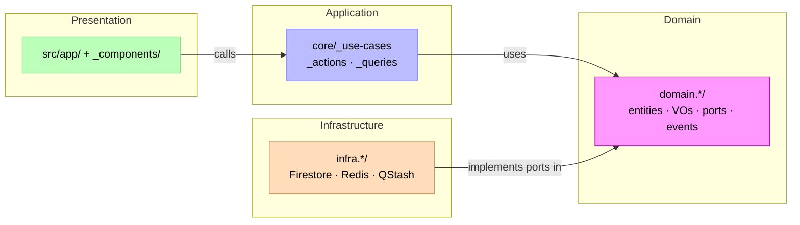

# Xuanwu Architecture Overview / 架構快速參考

> Tags: `architecture` `overview` `onboarding` `quick-reference`（定義見 [Tag Taxonomy](../management/documentation-index.md#tag-taxonomy)）
> Canonical definitions: [Model-Driven Hexagonal Architecture](./notes/model-driven-hexagonal-architecture.md)

---

## 1) One-minute Orientation

- Framework: Next.js 15 + TypeScript 5
- Style: Modular DDD + Hexagonal Architecture
- Core rule: Presentation → Application → Domain ← Infrastructure
- Bounded context unit: `src/modules/{module-name}.module/` with `index.ts` as public API



---

## 2) Repository Layout Snapshot

```text
src/
├── app/                  # Next.js routes & UI entry
├── modules/              # Bounded contexts (Modular DDD)
├── design-system/        # UI primitives/components/patterns/tokens/layout
├── shared/               # cross-cutting utilities/types/i18n
└── infrastructure/       # external adapters (Firebase/Upstash/etc.)
```

---

## 3) Where to Read Next

| Need | Read |
|---|---|
| Full architecture principles and vocabulary | [notes/model-driven-hexagonal-architecture.md](./notes/model-driven-hexagonal-architecture.md) |
| Entity/event/boundary contracts | [catalog/index.md](./catalog/index.md) |
| Domain terms | [glossary/glossary.md](./glossary/glossary.md) |
| Decision history | [adr/README.md](./adr/README.md) |
| Doc ownership and anti-duplication rules | [../management/documentation-index.md](../management/documentation-index.md) |

This page intentionally stays short; detailed definitions are centralized in the architecture SSOT.
